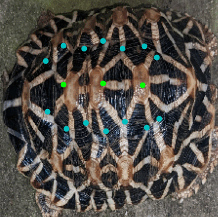

# Shell Alignment

Current [cropped images](https://drive.google.com/drive/folders/1Xu9_Hv8xCi1pOGO4If09JNfoaNtD90ZD?usp=share_link) and [keypoint annotations](https://drive.google.com/file/d/1Wnwq_RzJVcSzDTX9U193tf4_5Dj7z2QC/view?usp=share_link)

# Three Steps:
1. Shell Detection (Object detection)
2. Keypoint Detection ([notebook](notebooks/keypoint_detection.ipynb))
3. Affine Transformations ([notebook](notebooks/affine_transformations.ipynb))

# Keypoint Detection

Currently uses EfficientNetV2B0. Trained with 81 images recieved BEFORE October. 9 of those images were held as a validation set.

Model | Input Size | Val % MAE | Val % MSE | Val MAE | Val MSE |
----- | ---------- | ----- | ----- |---- |---- |
EfficientNetV2B0 | 224 | 0.03806 | 1.5514 | 8.5255 | 341.5201 |
